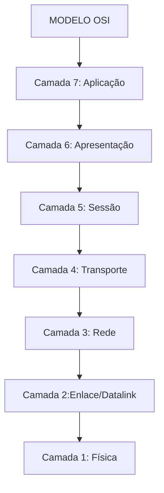
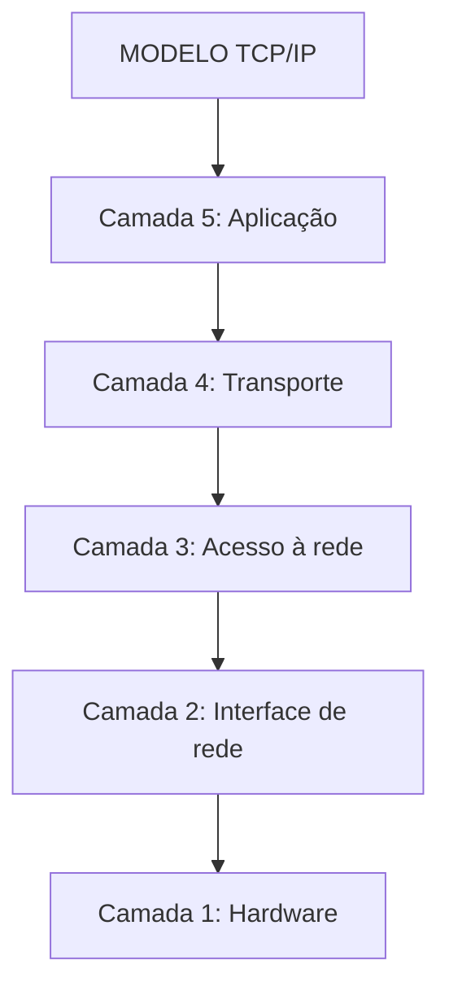

```mermaid
flowchart TD
  A[MODELO OSI] --> OSI7[Camada 7: Aplicação]
  OSI7 --> OSI6[Camada 6: Apresentação]
  OSI6 --> OSI5[Camada 5: Sessão]
  OSI5 --> OSI4[Camada 4: Transporte]
  OSI4 --> OSI3[Camada 3: Rede]
  OSI3 --> OSI2[Camada 2:Enlace/Datalink]
  OSI2 --> OSI1[Camada 1: Física]
```

```mermaid
flowchart TD
  A[MODELO TCP/IP] --> TCP5[Camada 5: Aplicação]
  TCP5 --> TCP4[Camada 4: Transporte]
  TCP4 --> TCP3[Camada 3: Acesso à rede]
  TCP3 --> TCP2[Camada 2: Interface de rede]
  TCP2 --> TCP1[Camada 1: Hardware]
```